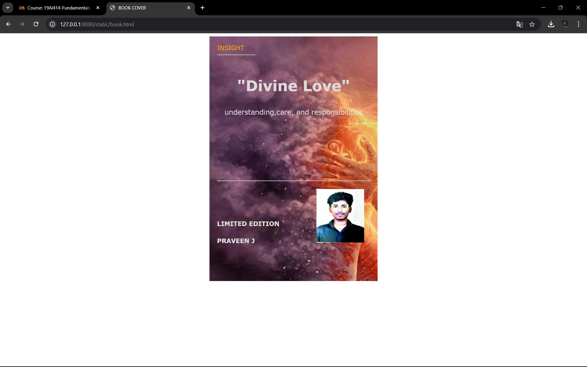

# Ex.06 Book Front Cover Page Design
## Date:

## AIM:
To design a book front cover page using HTML and CSS.

## DESIGN STEPS:

### Step 1:
Create a Django Admin project.

### Step 2:
Create an app in the Django interface.

### Step 3:
Create a folder named 'static' in the app folder.

### Step 4:
Create a new HTML file in the static folder.

### Step 5:
Write the HTML code with relevant CSS properties.

### Step 6:
Choose the appropriate style and color scheme.

### Step 7:
Insert the images in their appropriate places.

### Step 8:
Publish the website in the LocalHost.

## PROGRAM:
```html
<html>
<head>
    <meta name="viewport" content="width=device=width, initial-scale=1.0">
    <style>

        .bookpage{
            width: 400px;
            height: 600px;
            color: gainsboro;
            margin-left: auto;
            margin-right: auto;
            padding: 20px;
            font-family: Verdana, Geneva, Tahoma, sans-serif;
            background-image: url(divine-love-and-personal-love.jpg);
            background-size: cover;
        }

        .insight{
            color: rgb(247, 162, 5);
        }

        .hrstyle{
            width: 100px;
        }

        .author{
            display: inline;
            position: relative;
            color: rgb(223, 226, 220);
            top: 230px;

            font-family: Verdana, Geneva, Tahoma, sans-serif;
            font-size: medium;
        }

        .booktitle{
            font-family: Verdana, Geneva, Tahoma, sans-serif;
            font-size: larger;
            text-align: center;
            position: relative;
            top: 30px;
        }

        .id{
            width: 400px;
            position: relative;
            top: 100px;
        }

        .pub{
            font-size: medium;
            position: relative;
            top: 230px;
            left: 315px;
        }

        .ed{
            color:  rgb(223, 226, 220);
            font-size: medium;
            font-family: Verdana, Geneva, Tahoma, sans-serif;
            position: relative;
            top: 150px;

        }

        .subtitle{
            font-family: Verdana, Geneva, Tahoma, sans-serif;
            font-size: large;
            position: relative;
            top: 40px;
        }

        .mypic{
            position: relative;
            top: 230px;
            left: 260px;
            width: 100px;
            height: 100px;
            background-size: cover;

        }
    </style>
    <title>BOOK COVER</title>
</head>
<body>
    <div class="bookpage">
        <div class="insight"> INSIGHT</div>
        <div class="hrstyle">
            <hr style="color:red">
        </div>
        <div class="booktitle">
         <h1>"Divine Love"
                </h1>
        </div>
        <div class="subtitle">
            <center>
                understanding,care, and responsibilities
            </center>
        </div>
        <div class="mypic">
            
        </div>
        <div class="id">
            <hr style="color: wheat">
        </div>
        <div class="author">
            <p><b> PRAVEEN J</b></p>
        </div>
        <div class="pub">
            
        </div>
        <div class="ed">
            <b>LIMITED EDITION</b>
        </div>
    </div>
</body>

</html>
```

## OUTPUT:



## RESULT:
The program for designing book front cover page using HTML and CSS is completed successfully.
